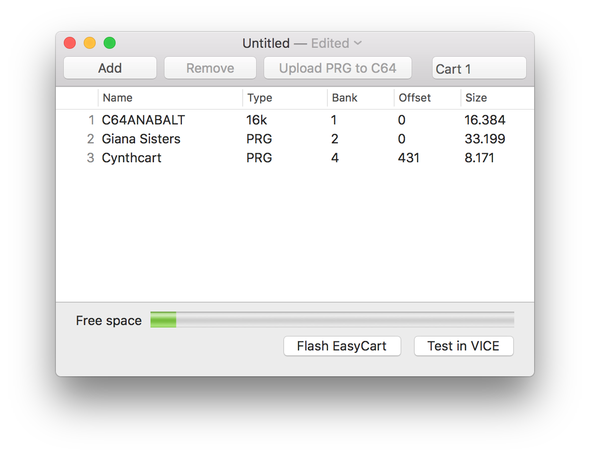

# EasyCart

EasyCart is a macOS application to pack Commodore 64 programs in a
cartridge ROM image to be used with
[EasyFlash](http://skoe.de/easyflash/doku.php?id=start)

## Features

- Supports addition of cartridges and `.prg` files
- Cartridge can be tested in the
  [VICE emulator](http://vice-emu.sourceforge.net)
- Individual `.prg` files can be sent to the C64 to be immediately executed
- ROM image can be flashed to
  [EasyFlash](http://skoe.de/easyflash/doku.php?id=start)

## Download

The project is hosted on GitHub:
- [Source Code](https://github.com/biappi/EasySynth)
- [Latest Release](https://github.com/biappi/EasySynth/releases/latest)

## Acknowledgements

EasyCart is heavily based on [ndefpack](http://ndefpack.sourceforge.net),
and includes code from several other open source projects:

- [libftdi](https://www.intra2net.com/en/developer/libftdi/)
- [libusb](http://libusb.info)
- [libusb-compat](http://www.libusb.org/wiki/libusb-compat-0.1) 

